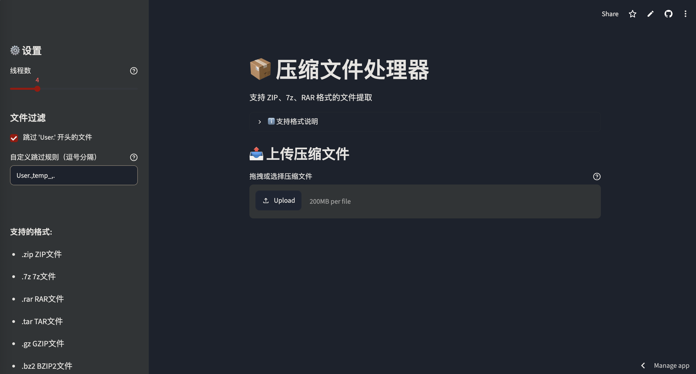

# 📦 压缩文件处理器 (Streamlit版)

一个基于 Streamlit 的网页版压缩文件提取工具，支持 ZIP、7z、RAR 格式，可直接在云端或本地运行。

## 📸 应用截图



## ✨ 功能特点

- **多格式支持**：支持 ZIP、7z、RAR 格式（含 RAR5）
- **智能格式检测**：通过魔数（Magic Number）自动识别压缩文件格式，不依赖文件扩展名
- **多线程处理**：可配置线程数，并行处理文件提取
- **智能过滤**：自动跳过临时文件和用户文件，可自定义过滤规则
- **去首层文件夹**：自动移除压缩包中的第一层目录，直接提取内容文件
- **一键下载**：处理完成后可直接下载提取结果（ZIP 格式）
- **响应式设计**：支持桌面端和移动端使用
- **Web 界面**：无需安装本地软件，浏览器中直接使用

## 🌐 支持格式

| 格式 | 云端（Streamlit Cloud） | 本地运行 |
|------|:---:|:---:|
| ZIP | ✅ | ✅ |
| 7z | ✅ | ✅ |
| RAR | ✅ | ✅ |

RAR 格式通过 `bsdtar`（libarchive）处理，`unar` 作为回退方案。

## 🚀 快速开始

### 环境要求

- Python 3.8+
- macOS / Linux / Windows

### 安装依赖

```bash
# 克隆项目
git clone https://github.com/Pikulo/zip_data_handling.git
cd zip_data_handling

# 安装依赖
pip install -r requirements.txt
```

### 运行应用

```bash
streamlit run streamlit_app.py
```

启动后，在浏览器中打开 `http://localhost:8501` 即可使用。

## ☁️ 部署到 Streamlit Cloud

1. Fork 本仓库到你的 GitHub 账号
2. 登录 [Streamlit Cloud](https://share.streamlit.io/)
3. 选择仓库中的 `streamlit_app.py` 作为入口文件
4. 点击 Deploy 即可

部署时会自动：
- 通过 `packages.txt` 安装系统依赖（`unar`、`libarchive-tools`）
- 通过 `requirements.txt` 安装 Python 依赖

## 📖 使用方法

1. **上传文件**：点击"选择压缩文件"或直接拖拽文件到上传区域
2. **配置过滤**：在侧边栏设置线程数和文件过滤规则
3. **开始处理**：点击"开始处理"按钮
4. **下载结果**：处理完成后可下载 ZIP 文件到本地

## ⚙️ 配置选项

| 选项 | 说明 | 默认值 |
|------|------|--------|
| 线程数 | 同时处理的文件数量 | 4 |
| 跳过 User. 文件 | 是否跳过以 User. 开头的文件 | 是 |
| 自定义过滤规则 | 逗号分隔的跳过前缀 | User.,temp_,. |

## 📦 依赖项

### Python 依赖

```
streamlit>=1.28.0
py7zr>=0.20.0
```

### 系统依赖（Streamlit Cloud 自动安装）

- `unar`：RAR 文件解压工具
- `libarchive-tools`：提供 `bsdtar`，用于 RAR5 格式解压

## 🛠️ 技术栈

- **前端**：Streamlit
- **后端**：Python
- **压缩库**：py7zr、zipfile、bsdtar、unar
- **并发处理**：concurrent.futures.ThreadPoolExecutor

## 📝 文件结构

```
.
├── streamlit_app.py          # 主应用文件
├── requirements.txt          # Python 依赖配置
├── requirements_streamlit.txt # Streamlit Cloud 专用依赖
├── packages.txt              # 系统依赖（云端部署）
├── README.md                 # 项目说明
├── LICENSE                   # MIT 许可证
└── docs/
    └── images/               # 项目截图资源
        └── Snipaste_2026-06-04_18-50-50.png
```

## 💻 本地运行（支持 RAR 格式）

如需处理 RAR 文件，请在本地运行：

```bash
# 安装 rarfile 依赖
pip install rarfile

# macOS
brew install unrar

# Ubuntu/Debian
sudo apt install unrar

# 运行应用
streamlit run streamlit_app.py
```

## 🤝 贡献

欢迎提交 Issue 和 Pull Request！

## 📄 许可证

本项目采用 MIT 许可证，详见 LICENSE 文件。

---

Made with ❤️ by Pikulo